# hse_hw1_meth

Ссылка на [коллаб](https://colab.research.google.com/drive/1OKaPWGUm4IB0n6o6hJ20e8IcXeqOXZW_?usp=sharing): 

Проведём сравнение с моим же отчетом вот [здесь](https://github.com/divanik/hse21_hw3/blob/main/multiqc_report.html)

Я взял 8cell.

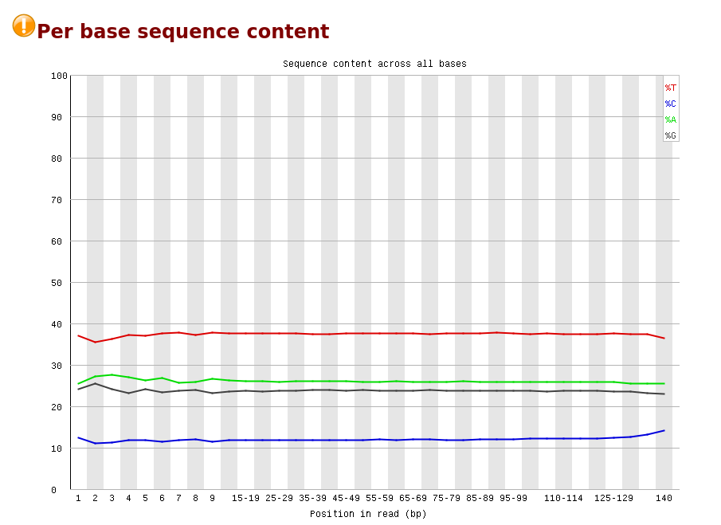

Во-первых, можно видеть, что тимина сильно больше, а цитозина сильно меньше чем в обычных ридах (даже в моем старом отчёте, где Per_base_sequence_content является аномальным, количество тимина не превышает 30%).

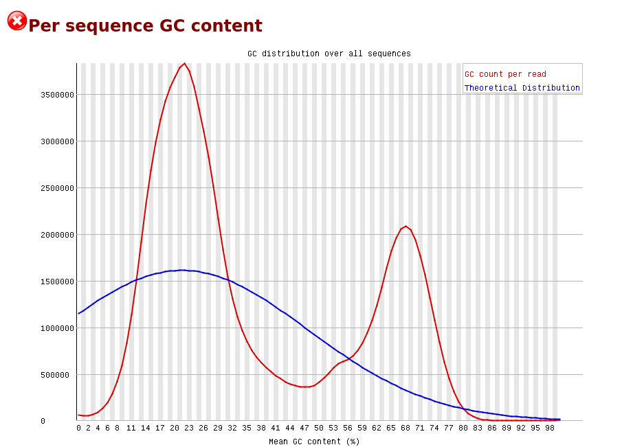

Во-вторых, аномальным является GC-content (распределение не унимодальное и вообще не напоминает нормальное)

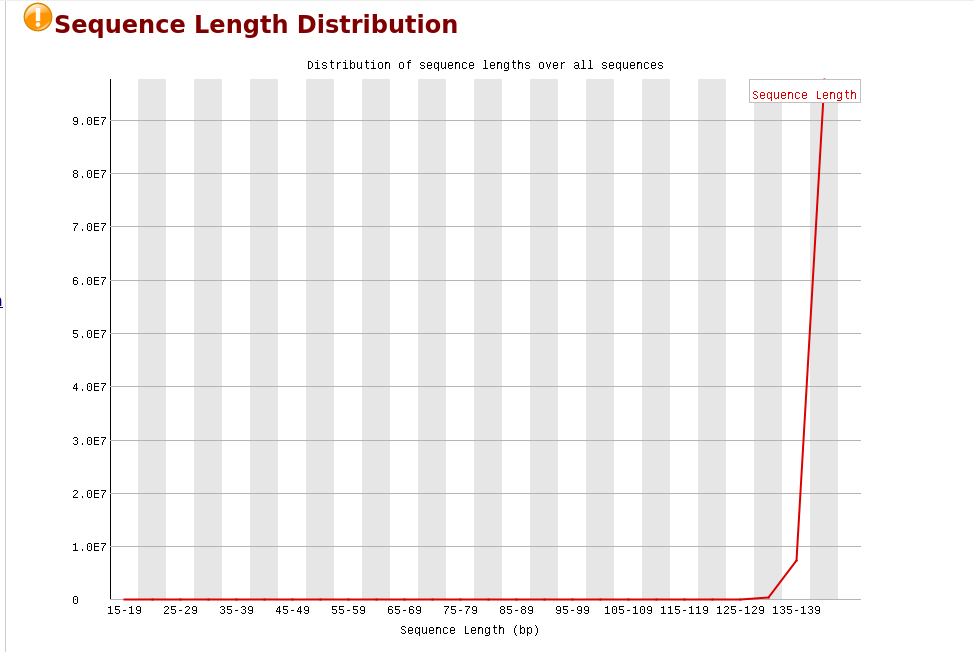

Также, распределение длин ридов тоже слегка отклоняется от нормы.

Напротив, в отличие от образцов, которые мы анализировали ранее (не только конкретно тот отчет, который я прикрепил), уровень дупликации и пропуска в данных приемлим, адаптеры отсутствуют

## Чтения на участке хромосоммы

|               |1347700-11367700|40185800-40195800|
|---------------|----------------|-----------------|
| 8cell         | 1090           |     464         |
| icm           |  1456          |      630        |
| epiblast      | 2328           |        1062     |

## Процент дуплицированных чтений

|               | percent |
|---------------|---------|
| 8cell         | 18.31 % |
| icm           | 9.08 %  |
| epiblast      | 2.92 %  |

## M-bias Plots

### 8cell
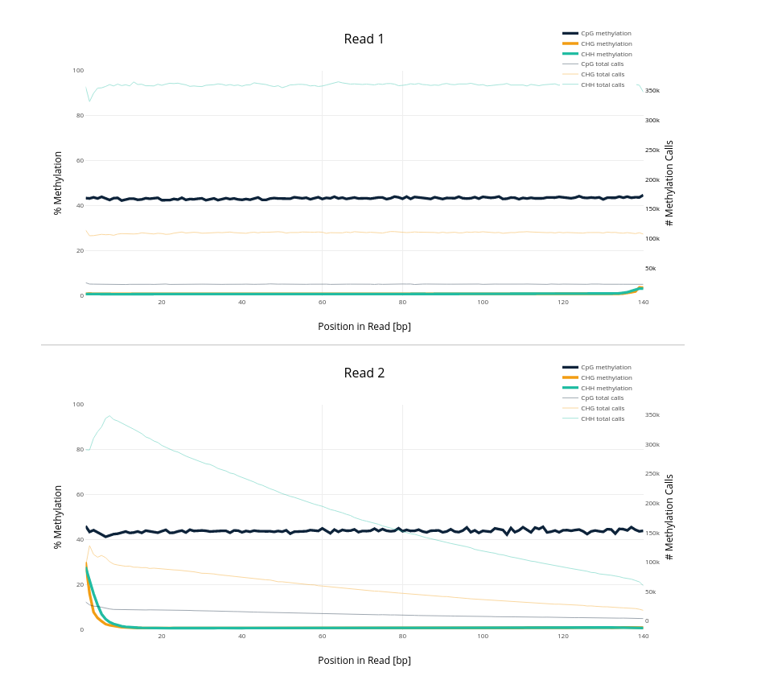
### Icm
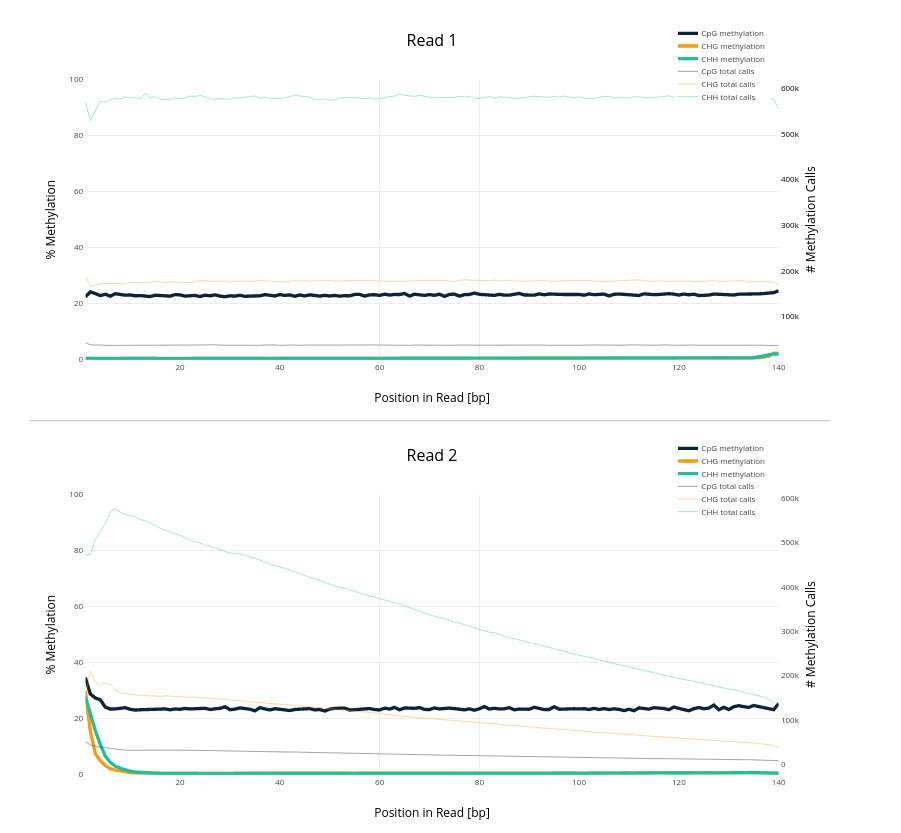
### Epiblast
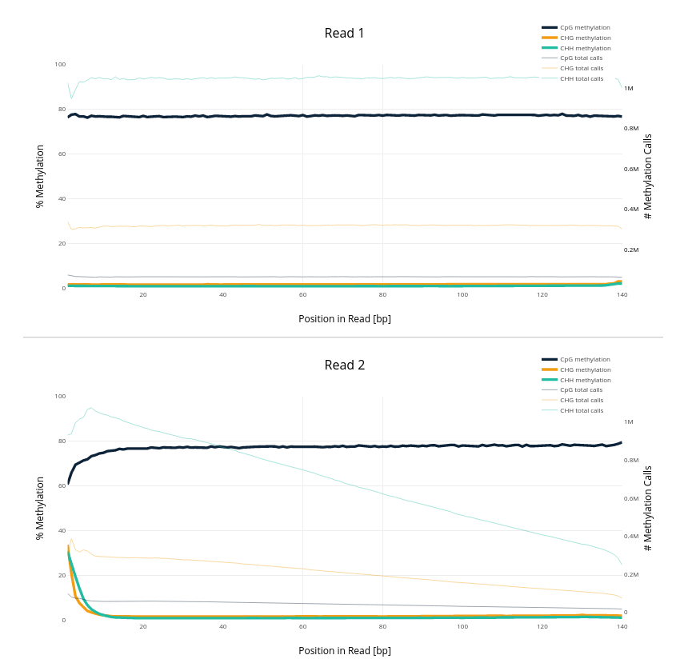

Я прочитал про m-bias plot в мануале. Объект нашего исследования СpG - для него графики выглядят более-менее адекватно (bias только на концах, такое бывает часто). Остальных объектов совсем немного, bias для них, очевидно большой, но в силу того, что абсолютные цифры небольшие - это не так страшно.

## Гистограммы

### 8cell
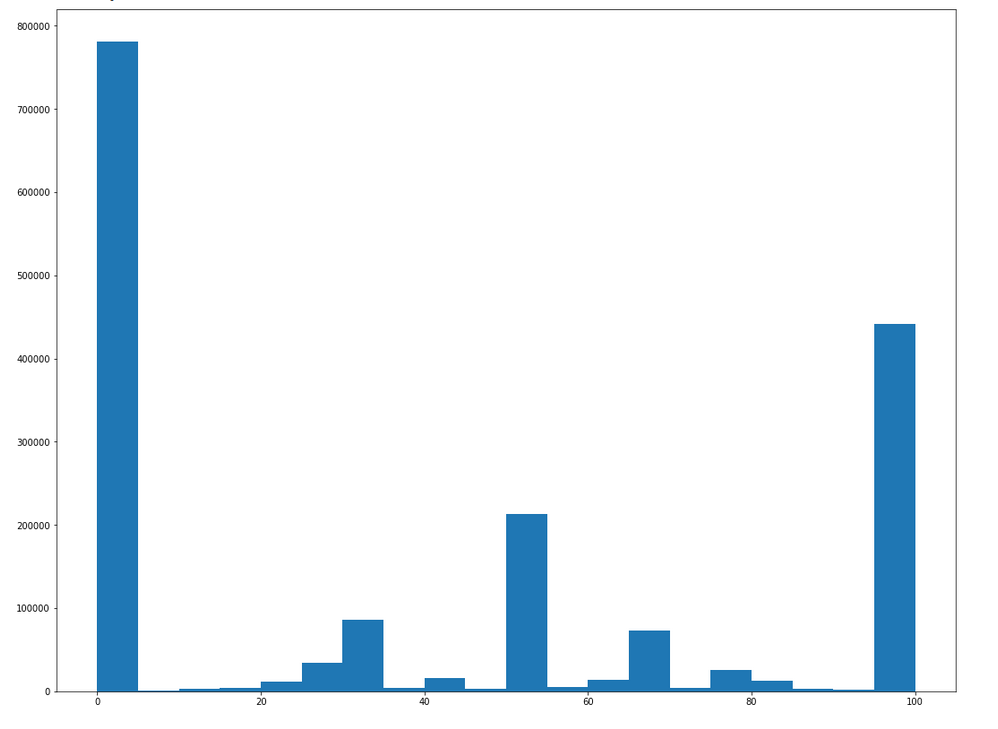

### Icm
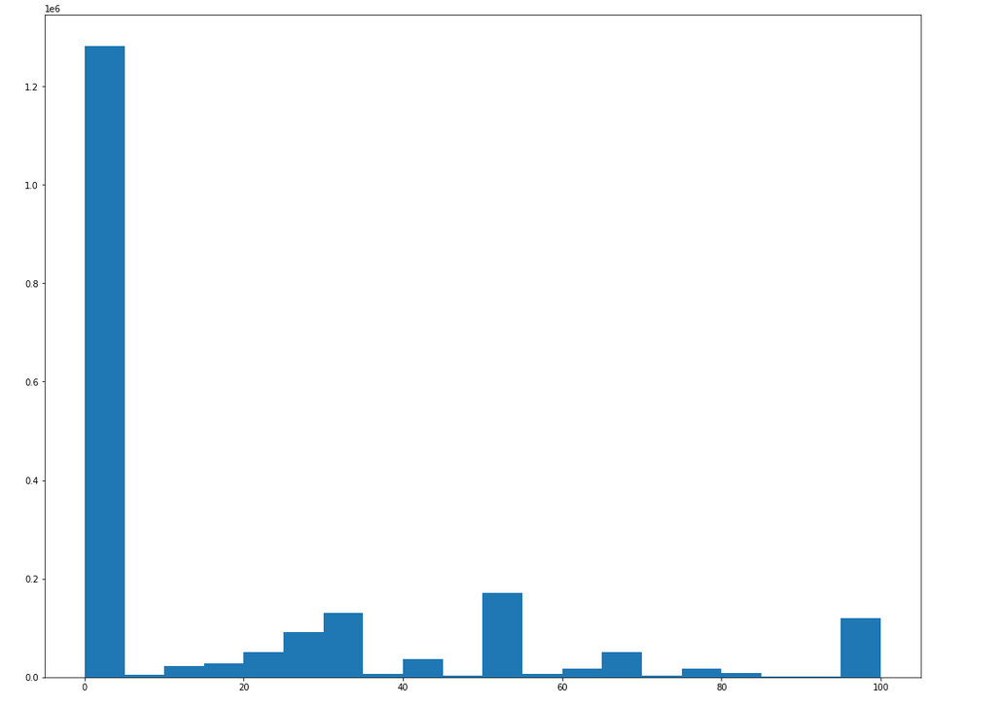

### Epiblast
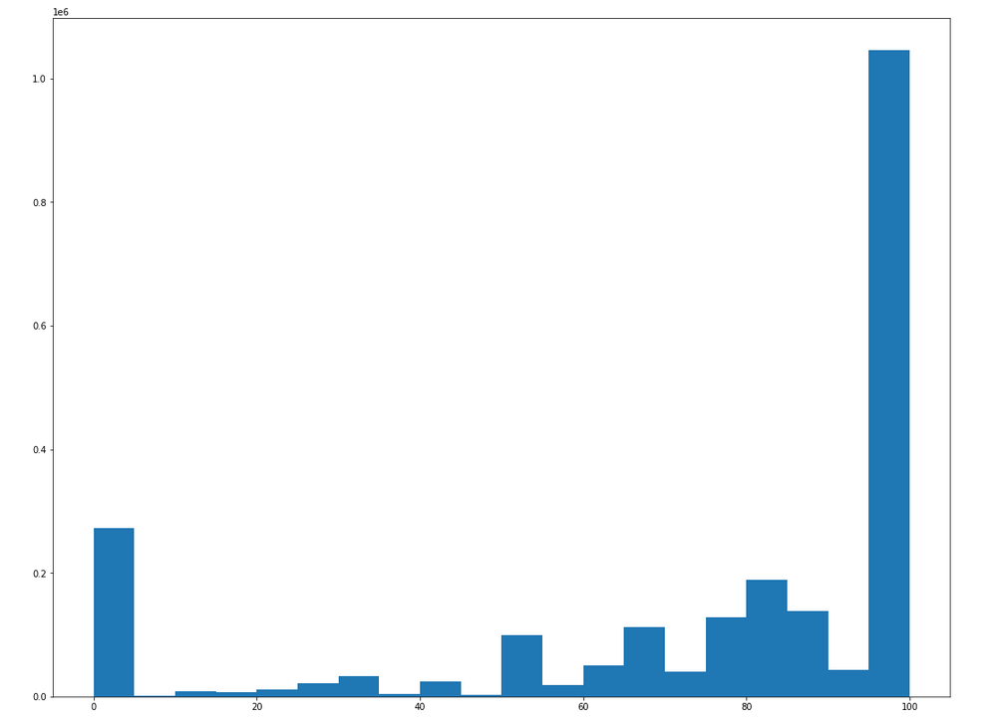

Из гистограмм можно видеть, что с начала уровень метилирования сильно уменьшился (мода и медиана - нулевой уровень), а затем резко увеличился (мода и медиана - стопроцентный уровень)

## Рисунки

### 8cell
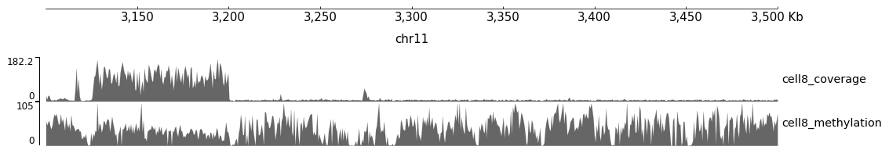

### Icm
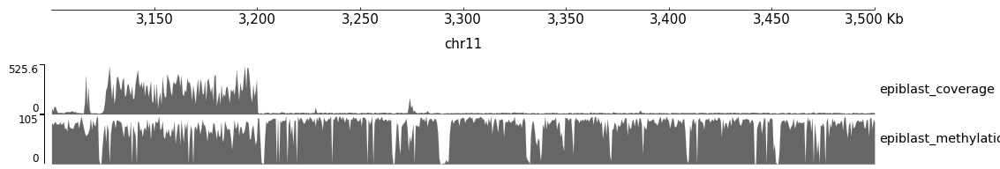

### Epiblast
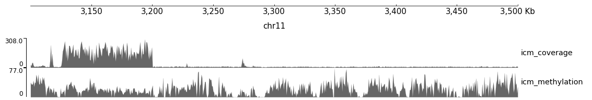
